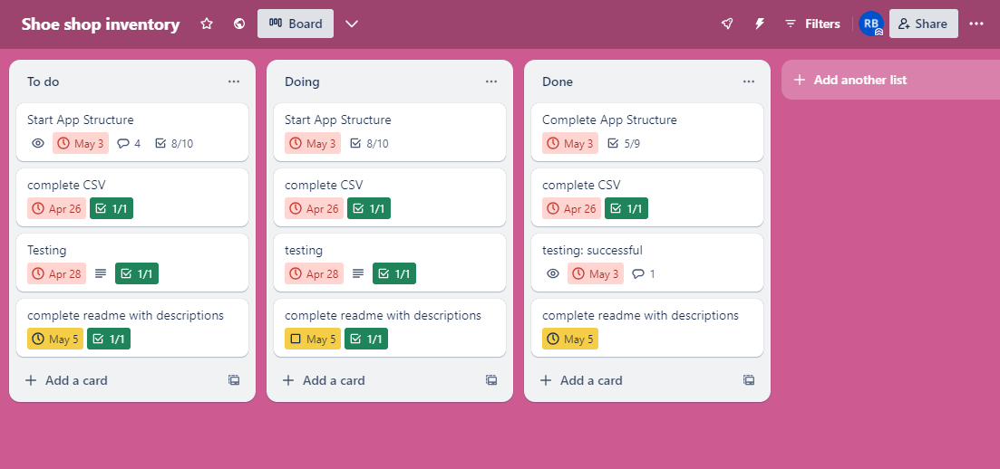
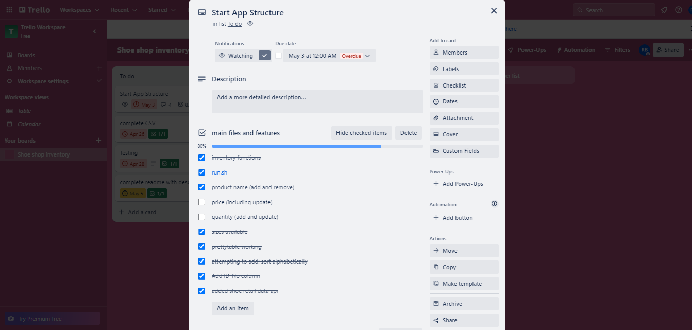
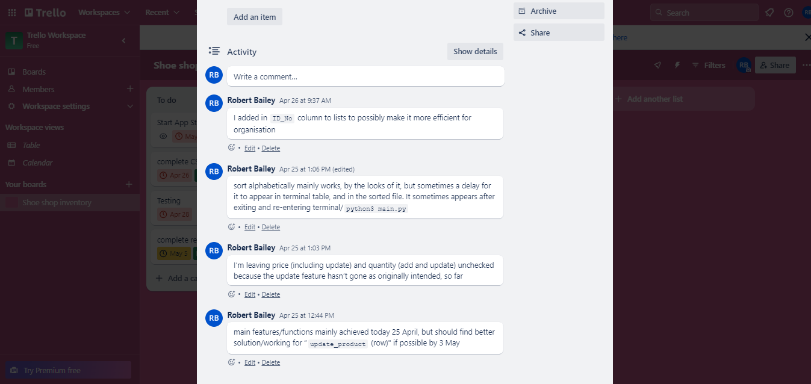
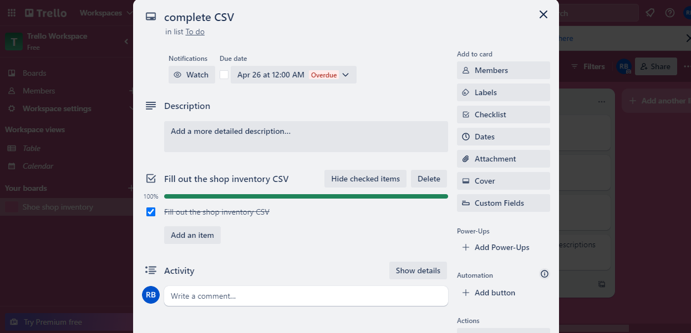
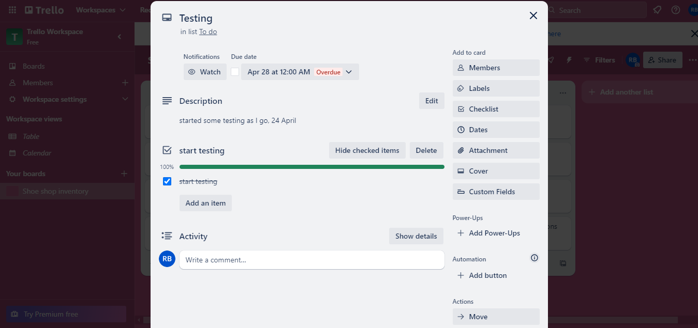
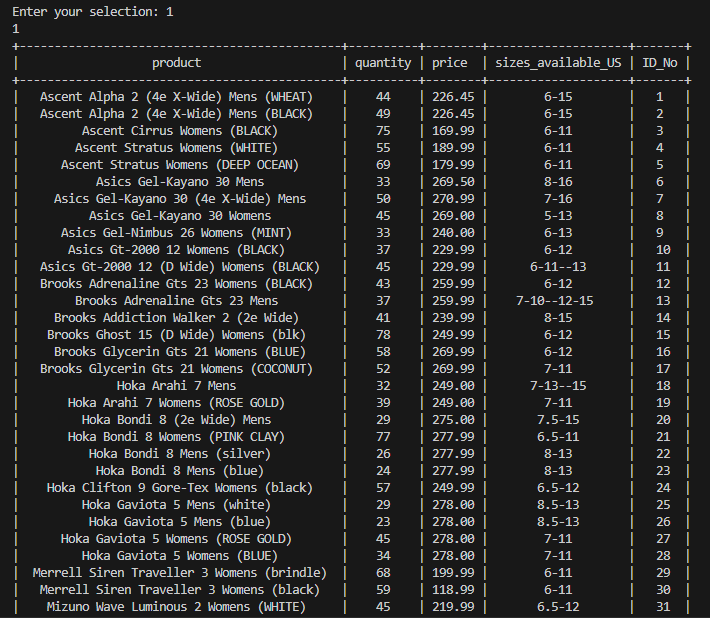
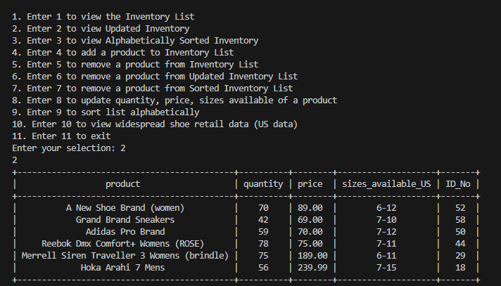
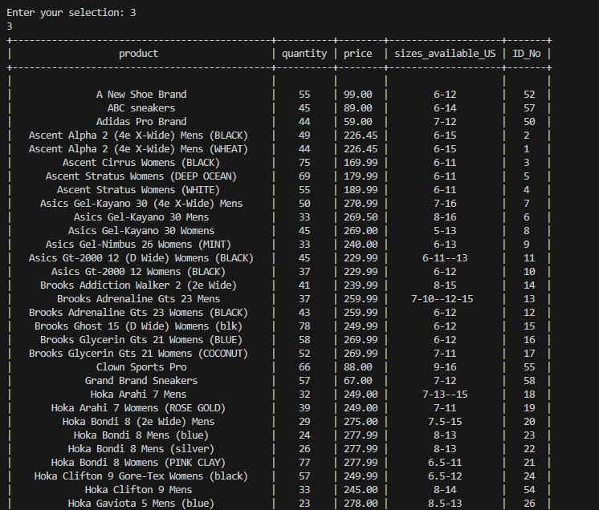
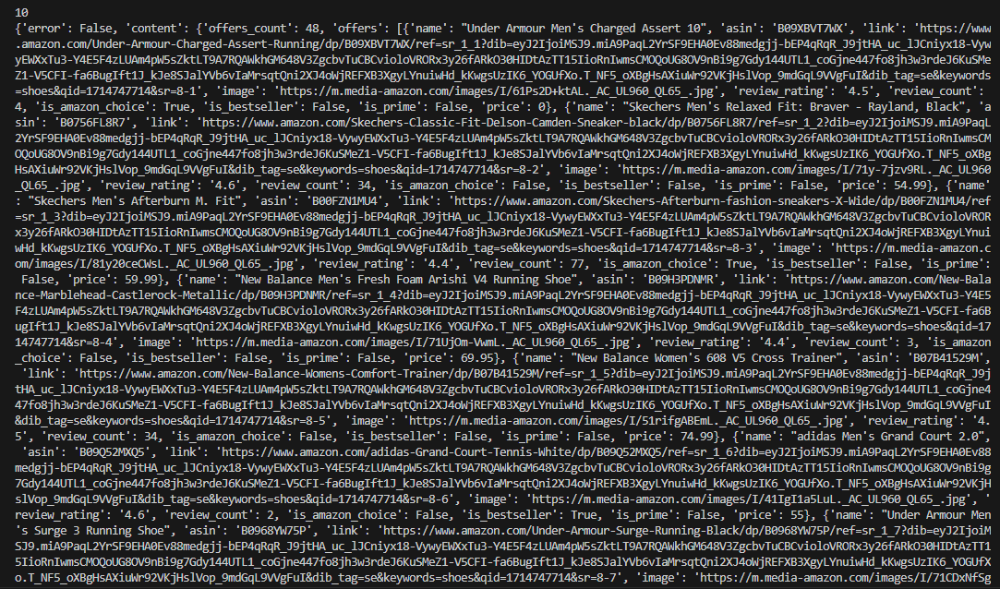
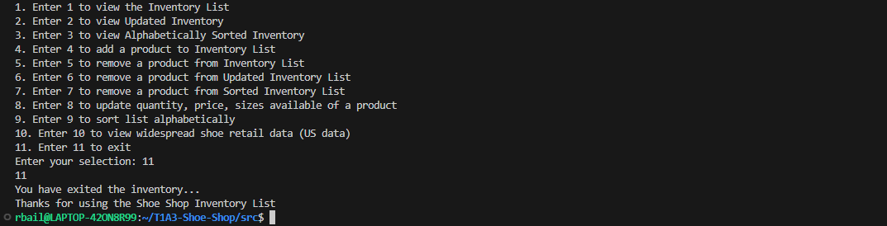

# T1A3-Shoe-Shop
This is a terminal application which will assist a shoe shop with keeping track of its stock. 
Staff of this shoe shop can:
- view industry-wide product information
- view three lists of their inventory, including alphabetically-sorted and updated
- add products to the inventory list, including quantity, price, and sizes available (US)
- remove products from these lists
- update product information, including quantity, price, and sizes available (US)

[Github Repository](https://github.com/RobertBail/T1A3-Shoe-Shop)

[Trello Board](https://trello.com/b/GFoxB2dv/shoe-shop-inventory)

## Table of Contents

- [Features](#features)
  - [View Inventory](#view-inventory)
  - [View Updated Inventory](#view_updated_inventory)
  - [View Sorted Inventory](#view_sorted_inventory)
  - [Add Product](#add_product)
  - [Remove Product From List](#remove_product_from_list)
  - [Remove Product From Updated List](#remove_product_from_updated_list)
  - [Remove Product From Sorted List](#remove_product_from_sorted_list)
  - [Update Product](#update-product)
  - [Sort Alphabetically](#sort_alphabetically)
  - [View Shoe Retail Data](#view-shoe-retail-data)
- [Code Style Guide](#code-style-guide)
- [Implementation Plan](#implementation-plan)
  - [Project Management Screenshots](#project-management-screenshots)
- [Testing](#testing)
- [Dependencies And Installation](#dependencies_and_installation)
- [References](#references)

## Features

### View Inventory
This feature allows staff to view the inventory list for the store, which is organised into a table. This table is enabled via the PrettyTable import.

The code for this feature involves:
- opening and "reading" the inventory_list.csv file
- indicating that the top line [0] should be the field names for the table
- having each row below the top line filled out with data
- having the resultant table printed/displayed in the terminal
- handling a FileNotFoundError exception, and the use of "try" for this error-handling

### View Updated Inventory
This allows staff to view a list of products which have had their information updated via the Update Product feature. This list is organised into a table via the PrettyTable import. This feature, involving another file, possibly goes against the DRY principle, but I added in this View Updated Inventory feature, and updated_inventory_list.csv file, because the Update Product feature didn't turn out as I originally wanted and intended, with my knowledge of Python so far, so updated_inventory_list.csv is an interim solution. This will be further explained in the Update Product section of this ReadMe. The code for this feature has a similar structure to View Inventory, but I designated the file involved as "file_name2" for this other file.

### View Sorted Inventory
This feature enables staff to view the alphabetically sorted inventory list in the format of a table, via the PrettyTable import. The code for this feature has a similar structure to the "View Inventory" and "View Updated Inventory" features, but I designated the file involved as "file_name3" for sorted_inventory_list.csv.

### Add Product
This feature enables staff to add a new product to the inventory list, its new ID number (adding to the last ID number currently on the list), the product name or version (eg. colour, men, women), the quantity, the price, and sizes available (US).

Earlier on, I didn't have ID_No, but decided to include it as part of a solution for organisation. I decided to add in the ID_No variable for product ID numbers, which could help staff with their organisation of the different products and the inventory list. I was trying to find out how to auto-increment ID_No ideally, but couldn't find a great example/solution for this format and situation, eg. they often involved several more steps and a bit confusing, or didn't look to suit this purpose.

The code for this feature involves:
- implementing user inputs for staff to manually enter the new product ID number, its name or version, quantity, price, and sizes available (US)
- the "a" mode which opens the file for appending
- the newline='' argument, to help with proper formatting of the csv, each line, as I understand it
- the Python "writer" to produce, ie. write to, the inventory_list.csv
- the Python "writerow" to add this row of variables
- including a delimiter, the ',' to help with proper formating of each variable in the list
- handling a FileNotFoundError exception, and the use of "try" for this error-handling

### Remove Product From List
This feature allows staff to remove a product from the inventory list, ie. inventory_list.csv, if necessary.

The code for this feature involves:
- implementing a user input for staff to manually enter the ID number of the product that will be removed
- implementing "inventory_list = []" to declare the list and its contents
- the use of "r" for read mode
- the Python "reader" for the csv file
- stating "if (ID_No != row[0]):" to refer to rows other than the top row for row removal
- the Python "w" mode for writing/rewriting the resultant csv file
- stating "writer.writerows(inventory_list)" for the resultant/remaining rows in the list
- handling a FileNotFoundError exception, and the use of "try" for this error-handling

### Remove Product From Updated List
This feature allows staff to remove a product from the updated inventory list, ie. updated_inventory_list.csv, if necessary. The code for this feature has a similar structure to "remove from product list", ie. inventory_list.csv, but I designated the file involved as "file_name2" for updated_inventory_list.csv.

### Remove Product From Sorted List
This feature allows staff to remove a product from the alphabetically-sorted inventory list, ie. sorted_inventory_list.csv, if necessary. The code for this feature has a similar structure to the other "remove from list" features, but I designated the file involved as "file_name3" for sorted_inventory_list.csv.

### Update Product
This feature allows staff to update product information, including its name, quantity, price, and sizes available. At the moment, they will refer to the inventory_list.csv, and each ID_No, when updating each product. I originally wanted (thought the user could) modify this data individually/separately in each row, ie. separate functions/options for update quantity, price, sizes_available_US, and it wouldn't be much different than add_product function, and I originally wanted the updated data to be displayed in the original inventory_list.csv.
But this doesn't seem to be as possible or easy. I didn't see a good example for this scenario with a csv. I only saw this example for a [bakery](https://github.com/Amrinarosyd/basic_inventory_management_and_sales_system/blob/main/Sweet_Savory%F0%9F%8D%B0.py) in which all the data is on the one py file, and only 15 different products versus the potentially hundreds or thousands of products in a shoe retailer. Hence, I implemented the updated_inventory_list.csv as a current solution.

The code for this feature involves:
- implementing user inputs for staff to manually enter the product ID number, and update its name, quantity, price, and sizes available. If possible, I was wanting this to be more like "update_stock" in the [bakery](https://github.com/Amrinarosyd/basic_inventory_management_and_sales_system/blob/main/Sweet_Savory%F0%9F%8D%B0.py) example. The staff being able to individually select either name, quantity, price, and/or sizes available to update.
- the "a" mode which opens the file for appending
- the newline='' argument, to help with proper formatting of the csv, each line, as I understand it
- the Python "writer" to produce, ie. write to, the updated_inventory_list.csv
- the Python "writerow" to update this row of variables
- including a delimiter, the ',' to help with proper formating of each variable in the list
- handling a FileNotFoundError exception, and the use of "try" for this error-handling

### Sort Alphabetically
This feature enables staff to alphabetically sort the inventory list, ie. the original inventory_list.csv, to assist with their organisation of the inventory list and for quicker,easier viewing of each product name. However, I had to put ID No. as the last column of the lists and tables, because the "sort_alphabetically" function/list wasn't working properly with ID No. in first column. "sort_alphabetically" works much better with ID No. in the last column. This feature produces, ie. writes to, the sorted_inventory_list.csv.

The code for this feature involves several steps: read_csv(file_name), sort_alphabetically(data), write_csv(file_name, sorted_data), and sort_csv(file_name).

- read_csv(file_name) involves:
  - the use of "r" for read mode
  - the newline='' argument, to help with proper formatting of the csv, each line, as I   understand it (I forgot if it's necessary for this function or not)
  - the Python "reader" for the csv file, inventory_list.csv
  - reading then returning the list data
  - handling a FileNotFoundError exception, and the use of "try" for this error-handling

- sort_alphabetically(data) involves:
  - differentiating the header row, ie. top row [0] in this function, aiming to have it remain there
  - stating "sorted_data = sorted(data[1:], key=lambda x: x[0])" as the primary instruction for sorting this data
  - and having the "sorted_data" returned

- write_csv(file_name, sorted_data) involves:
  - the Python "w" mode for writing/rewriting the resultant csv file
  - the newline='' argument, to help with proper formatting of the csv, each line, as I   understand it
  - the Python "writerows" to display the alphabetically sorted data, ie. the resultant rearranged rows
  - handling a FileNotFoundError exception, and the use of "try" for this error-handling

- sort_csv(file_name) involves:
  - handling and producing the sorted_inventory_list.csv, as result of the previous steps/functions

### View Shoe Retail Data
I decided to add this in later on in the development of this app. This feature involves a product data API, which could be helpful for staff to find product information elsewhere, eg. amongst competitors, in shoe retail sales. This API references US-related data. I tried to find an API with much more widespead industry/sales information, but this Amazon one seemed to be the best I saw, amongst free-of-charge APIs at least. At the time of writing this ReadMe, I was interested in seeing how to display this data in a table format if possible.

This data displayed in the terminal indicates information such as review ratings, current price, and whether it's a best-seller, for each shoe item on Amazon. Staff at this shoe shop can preview trending stock, and their properties and value.

The code for this feature involves:
- reference to API URL, for Amazon Merchant Data via RapidAPI
- reference to the "querystring" which includes the term "shoes" and the country "us"
- headers for the Key and Host
- the response from the "get", which invloves the requests import
- and printing the data in the terminal via JSON
- I think there is an inherent error from this API which I saw in the terminal once, along the lines of "Amazon not available" perhaps if this API URL is briefly unreachable

## Code Style Guide
The code for this application was written in accordance with the [PEP 8 Style Guide for Python](https://peps.python.org/pep-0008/). This style includes:
- Use of lower case variables with underscores, except for abbreviations like US and ID_No, to indicate these a bit more clearly on the tables, and "UpdatedList" and "SortedList" to read these more easily
- 4 space indentation
- Blank lines to seperate functions
- Use of double quotes mostly. I think I saw a few single quotes in examples, so I used a few of those.

## Implementation Plan
I used Trello to overall plan the development of this application, such as the completion of each feature, the initial collection of shoe product data for the inventory_list.csv, for which I primarily referred to The Athlete's Foot website for some indication, and completion of testing. The Sort Alphabetically and View Shoe Retail Data features I decided to add in later on during developement, because I became aware these might be useful or necessary to the shoe shop staff. I have left "price (including update)" and "quantity (add and update)" unchecked because these update features haven’t gone as originally intended.

Trello Main View:

Trello To-Do:

Trello To-Do Comments:

Completing the Inventory CSV:

Testing the app:

## Testing
Testing of this application has been regularly conducted to ensure its efficient function. One noticeable bug to be aware of is sometimes when using Add Product, Sort Alphabetically, or Update Product, the respective lists don't immediately update when using the "View..." features afterwards. Exiting then relaunching the application, or exiting then re-entering the terminal and relaunching "python3 main.py" can have these lists properly updated.

## Dependencies And Installation
The installation and use of Python 3 is required to run this application. This application also uses prettytable version 3.10.0, os, csv, requests and json. In future, I may add colored version 2.2.4. and wcwidth version 0.2.13 if necessary.

To install this app, download the "src" folder containing the source code of the project.
Run the "run.sh" bash script which will set up a virtual environment and start the application for you automatically.

## Using the Application
After the app is properly installed, you can enter "python3 main.py" in the terminal to start this application. Shoe shop staff can navigate to different features and complete tasks by following the prompts in the menu. A few examples of using the Shoe Shop inventory app are displayed below.

Viewing Inventory Table:

Viewing Updated Inventory Table:

Viewing Alphabetically-Sorted Table:

Viewing Shoe Retail Data:

Exiting the App:

## References

van Rossum, G, Warsaw, B, Coghlan, A 2013, "PEP 8 – Style Guide for Python Code", Python, accessed 4 May, 2024, https://peps.python.org/pep-0008/